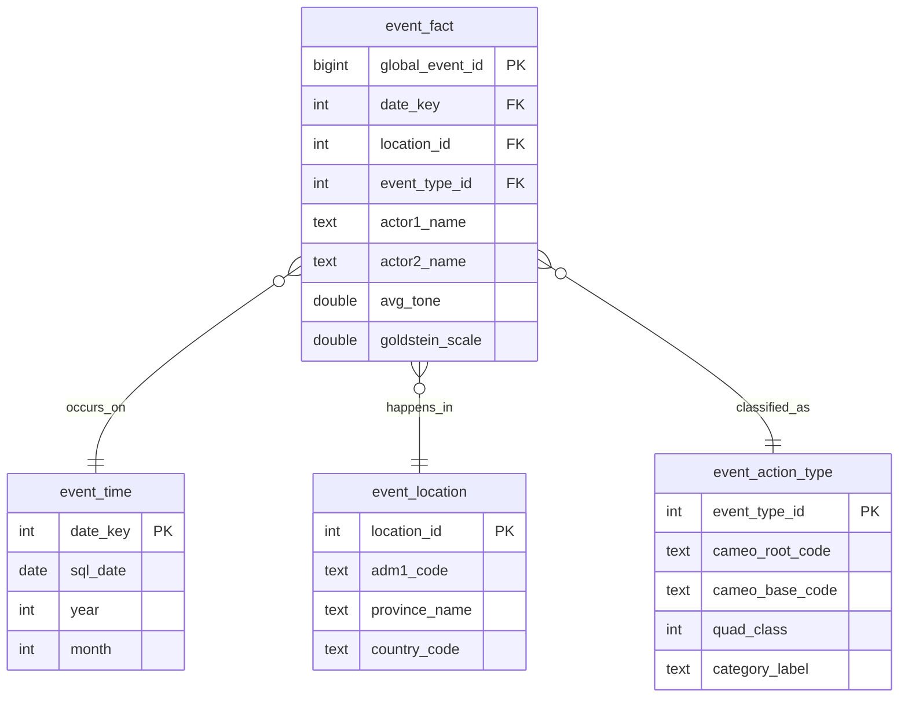

# SA Civic Pulse

A data pipeline that tracks events across South African provinces,
built from the [GDELT Project](https://www.gdeltproject.org/)'s global event database.

Built as a Data Engineering elective project to demonstrate ETL pipeline design, star
schema modelling, containerization, and CI/CD automation — and a dataset with real 
South African relevance.

## What it does

GDELT scans global news coverage every 15 minutes and extracts structured "events"
(who did what to whom, where, and how the coverage read). This project filters that
firehose down to events located in South Africa, cleans and categorizes them, and
serves them through a REST API — letting you ask questions like "what is the total
amount of events recorded within that time" or "what are the most common event 
types reported in the Western Cape?"

## Tech stack

| Tool | Role |
|---|---|
| **GDELT** | Raw data source (free, updated every 15 minutes) |
| **PySpark** | Filters and cleans millions of global rows down to South African events |
| **Docker + Postgres** | Local data warehouse (star schema) |
| **FastAPI** | REST API serving the cleaned data |
| **GitHub Actions** | CI (tests on every push) + scheduled pipeline runs |

## Architecture

```
GDELT files (raw, HTTP)
   ↓ extract.py
data/raw/ (local, gitignored)
   ↓ transform.py (PySpark)
data/processed/ (parquet, cleaned + filtered to South Africa)
   ↓ load.py
Postgres (Docker) — star schema warehouse
   ↓ serve
FastAPI — REST endpoints
   ↑ orchestrated/scheduled by
GitHub Actions (CI on push + scheduled pipeline runs)
```

## Database schema

One row per GDELT event mention, linked to three dimension tables:



## Environment variables

The project reads its database credentials from a `.env` file at the project root
(used by both `compose.yml` and the Python scripts). Copy the template and
adjust if needed:

```bash
cp .env.example .env
```

.env should contain:
```bash
POSTGRES_HOST=localhost
POSTGRES_PORT=5050
POSTGRES_DB=sa_civic_pulse
POSTGRES_USER=admin
POSTGRES_PASSWORD=db_password
```

## Getting masterfilelist.txt

`extract.py` reads from a file called `masterfilelist.txt`, which is GDELT's own
index of every 15-minute data file it has ever published. This must be downloaded manually due to how large the file is, it's a one-time manual step:

1. Go to [gdeltproject.org/data.html#rawdatafiles](https://www.gdeltproject.org/data.html#rawdatafiles)
2. Under the GDELT 2.0 section, click **"Master CSV Data File List – English"**
3. Save the file as `masterfilelist.txt` in the **project root** (same folder as this README)

Or, directly from a terminal:
```bash
curl -o masterfilelist.txt http://data.gdeltproject.org/gdeltv2/masterfilelist.txt
```

This file is large (tens of MB) and updates every 15 minutes on GDELT's side, so
it's gitignored rather than committed — re-download it if it's ever missing or you
want the most current file listing.

## How to run it

**Prerequisites:** Docker, Python 3.10+, Java 17 (required by PySpark).

# 1. Set up and activate your virtual environment file
```bash
python3.12 -m venv .venv
source .venv/bin/activate
```

# 2. Create the virtual environment and install dependencies
```bash
make install
```

# 3. Start Postgres and apply the schema
```bash
make db-setup
make add-schema
```

# 4. Run the pipeline (extract -> transform -> load)
```bash
make run-pipeline
```

# 5. Run the API
```bash
make run-api
```

Then visit `http://localhost:8000/docs` for interactive API documentation.

Other useful commands:
```bash
make run-test    # run the test suite
make db-reset    # wipe and reapply the schema (careful -- deletes all loaded data)
make db-stop     # stop the Postgres container
make clean       # remove downloaded/processed data files
make help        # list all available commands
```

## API Endpoints & Examples

Once the server is running on `http://localhost:8000`, interactive Swagger documentation is available at `/docs`.

### Summary of Endpoints

| Method | Endpoint | Description |
|---|---|---|
| `GET` | `/` | API status check and welcome message |
| `GET` | `/provinces` | List recorded provinces with total event counts and average tone |
| `GET` | `/event-types/top` | Most frequent CAMEO categories (overall or per province) |
| `GET` | `/events` | Paginated list of events filtered by province or date range |
| `GET` | `/events/count` | Total count of events matching filter criteria without fetching rows |
| `GET` | `/events/{event_id}` | Full detail for a single GDELT event by its `global_event_id` |

---

### Example Requests

#### 1. Discovery: List recorded provinces and event volumes
```bash
curl "http://localhost:8000/provinces?min_count=10"
```

**Example Response:**
```json
[
  {
    "province_name": "Western Cape",
    "adm1_code": "SF11",
    "event_count": 482,
    "avg_tone": -2.31
  },
  {
    "province_name": "Gauteng",
    "adm1_code": "SF06",
    "event_count": 395,
    "avg_tone": -3.85
  }
]
```

#### 2. Discovery: Top event types in a target province
Find the top 5 most frequent CAMEO event categories in the Western Cape:
```bash
curl "http://localhost:8000/event-types/top?province=Western%20Cape&limit=5"
```

**Example Response:**
```json
[
  {
    "cameo_root_code": "14",
    "category_label": "Protest",
    "quad_class": 3,
    "event_count": 142
  },
  {
    "cameo_root_code": "02",
    "category_label": "Appeal",
    "quad_class": 1,
    "event_count": 89
  }
]
```

#### 3. Filtering: Search individual events
Query up to 10 events from Gauteng within a date range:
```bash
curl "http://localhost:8000/events?province=Gauteng&start_date=2026-01-01&end_date=2026-06-30&limit=10"
```

**Example Response:**
```json
[
  {
    "global_event_id": 1320689300,
    "sql_date": "2026-05-14",
    "province_name": "Gauteng",
    "category_label": "Make public statement",
    "actor1_name": "SOUTH AFRICA",
    "actor2_name": "COMMUNITY",
    "avg_tone": -1.45,
    "goldstein_scale": 3.4,
    "source_url": "[https://www.iol.co.za/news/example-story](https://www.iol.co.za/news/example-story)"
  }
]
```

#### 4. Quick Count: Total matching rows without fetching full payloads
```bash
curl "http://localhost:8000/events/count?province=KwaZulu-Natal&cameo_root_code=14"
```

**Example Response:**
```json
{
  "total_events": 84
}
```

#### 5. Detailed Lookup: Single event by ID
```bash
curl "http://localhost:8000/events/1320689300"
```

**Example Response:**
```json
{
  "global_event_id": 1320689300,
  "sql_date": "2026-05-14",
  "year": 2026,
  "month": 5,
  "adm1_code": "SF06",
  "province_name": "Gauteng",
  "country_code": "SF",
  "cameo_root_code": "01",
  "cameo_base_code": "010",
  "quad_class": 1,
  "category_label": "Make public statement",
  "actor1_name": "SOUTH AFRICA",
  "actor1_country": "SAF",
  "actor2_name": "COMMUNITY",
  "actor2_country": null,
  "goldstein_scale": 3.4,
  "avg_tone": -1.45,
  "num_mentions": 4,
  "num_sources": 2,
  "num_articles": 4,
  "source_url": "[https://www.iol.co.za/news/example-story](https://www.iol.co.za/news/example-story)",
  "date_added": "2026-05-14T08:15:00Z"
}
```

## Known limitations

- **Duplicate event mentions.** GDELT records one row per article, not one row per
  real-world event — multiple articles covering the same incident produce multiple
  rows with near-identical fields. This project does not attempt to deduplicate
  these; the schema keys on the raw `global_event_id`, so a "number of events"
  count reflects article volume, not necessarily distinct real-world incidents.

- **Geocoding granularity varies.** Roughly 20% of South African rows only resolve
  to country level (no specific province), rather than city or province level. These
  are represented in `event_location` as a fallback `'SF'` / "Unknown / National"
  row rather than dropped.

- **Not all "South Africa" rows are domestic South African news.** GDELT tags events
  by where they're geographically referenced, not strictly where the story is "about."
  A small number of rows are global stories (e.g. international relations coverage)
  that happen to mention South Africa.
```

WTC Code:
WTC-3DK57ZMT

Youtube demo link:
https://youtu.be/354o1ldHfO4
